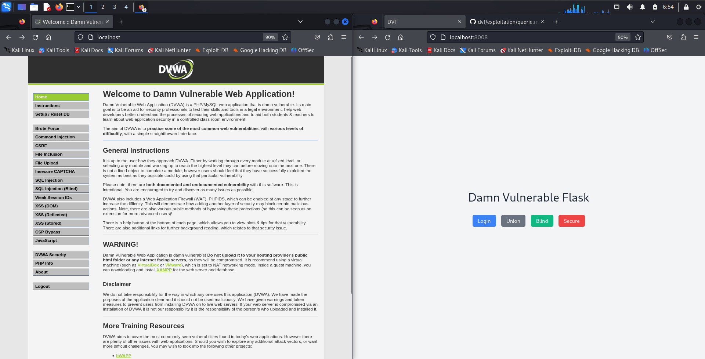

#  Principles of information security 
## Damn Vulnerable Flask App 

### Download docker
```bash
newgrp docker
sudo usermod -aG docker $USER
curl https://get.docker.com | bash
```

### Set up DVWA
```bash
docker run -d -p 80:80 vulnerables/web-dvwa
```

### Set up DVF
```bash
docker compose up -d
```

### Random cool docker commands
* Inspect docker ip addresses of containers 
```bash
docker network inspect postgres16_network -f '{{range .Containers}}{{.Name}} {{.IPv4Address}}{{end}}'
```
* Clear all Dcoker running containers, and all downloaded images
```bash
docker rm -f $(docker ps -a -q)
docker image rm -f $(docker images -q)
```

### Exploitation Techniques 
* [SQLi](./exploitation/querie.md)
* [SQLMap + Extras](./exploitation/sqlmap.md)

### [Screenshots](./exploitation/screenshots.md)
<center>
    
</center>